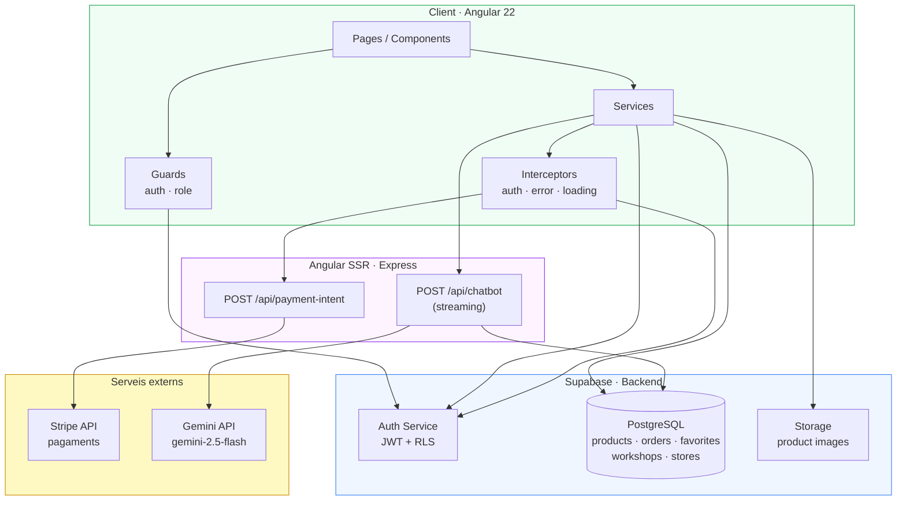
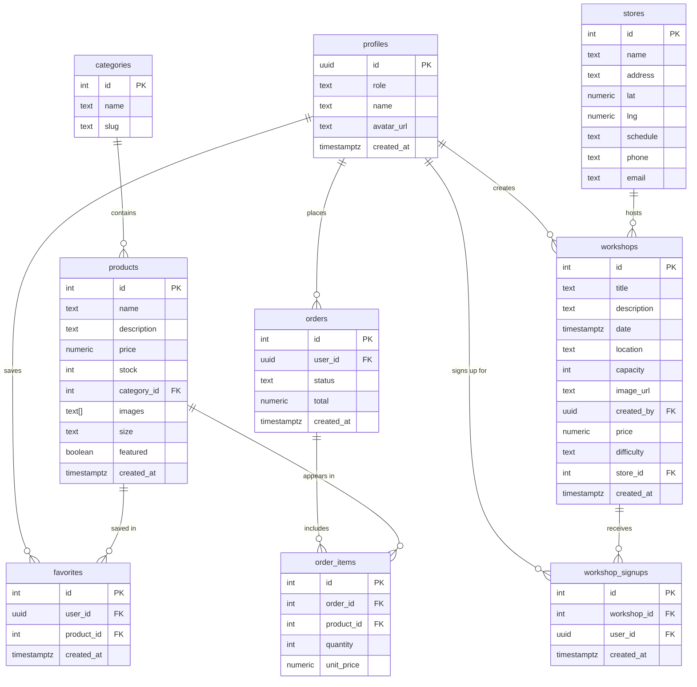
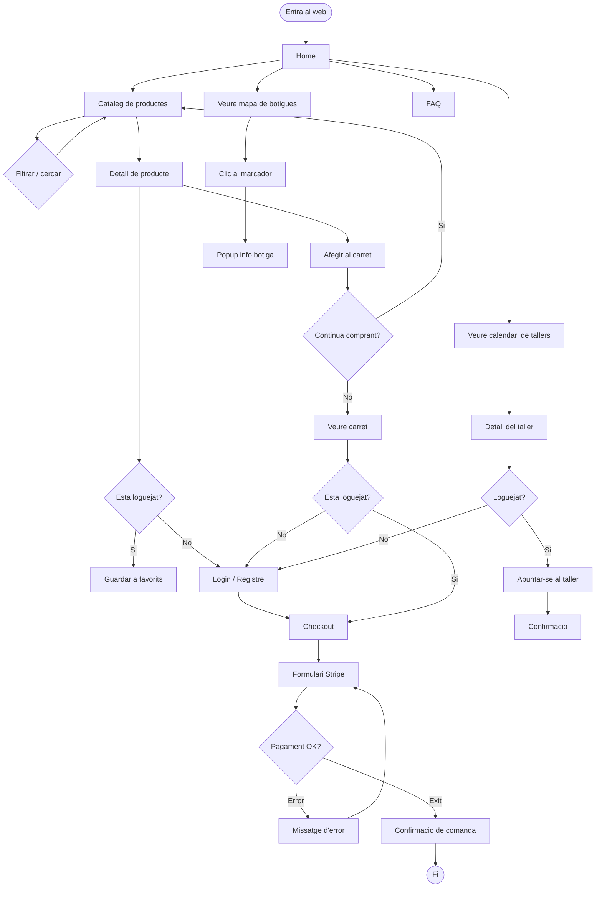
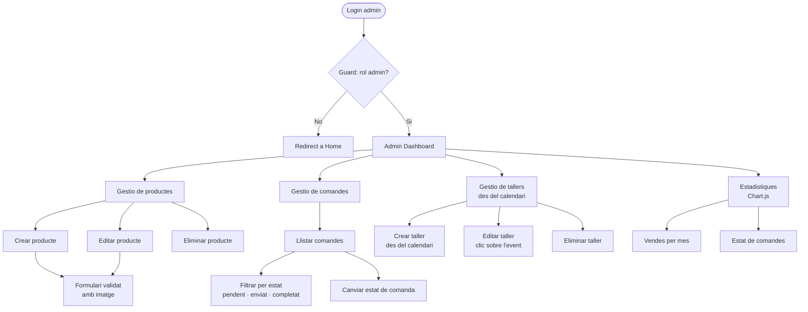
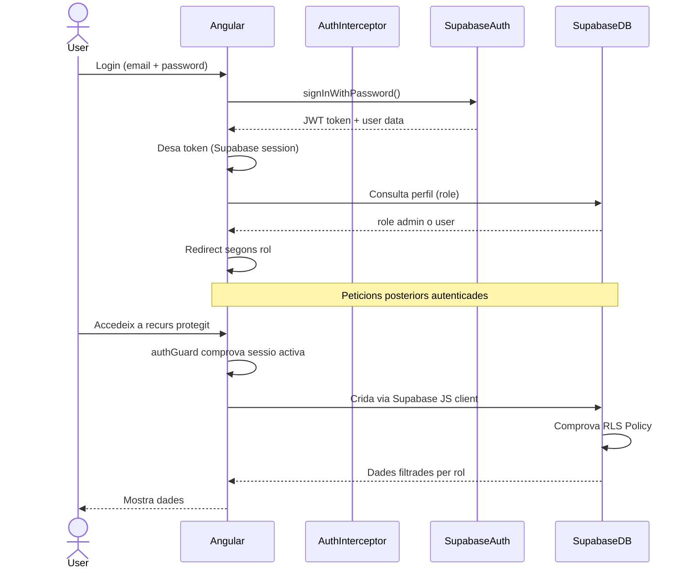
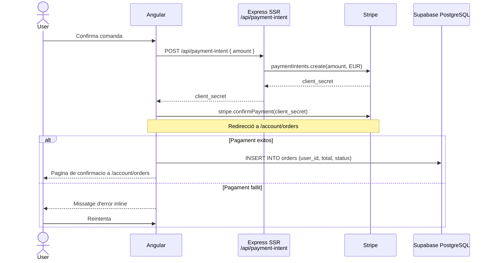
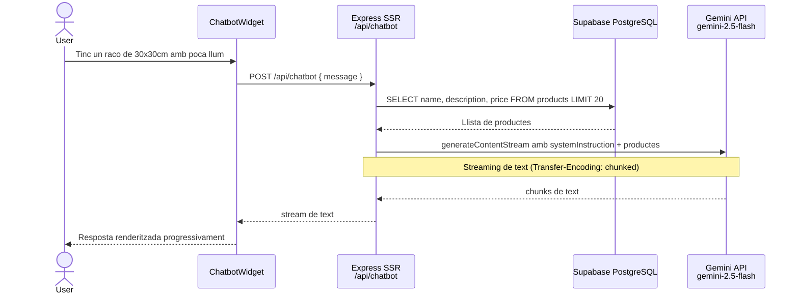
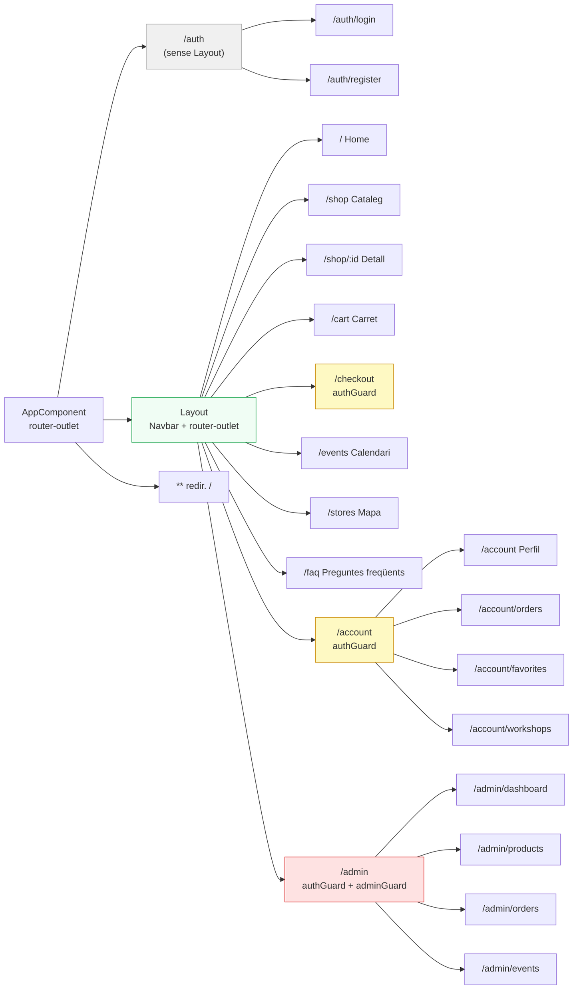

# Jardí d'hivern — Diagrames tècnics

> Tots els diagrames en format Mermaid. Es renderitzen a GitHub, Linear i VSCode (extensió Mermaid Preview).

---

## 1. Arquitectura del sistema

---

## 2. Model de dades (ER Diagram)

---

## 3. User Flow — Comprador (guest / usuari loguejat)

---

## 4. User Flow — Administrador

---

## 5. Flux d'autenticació (Sequence Diagram)

---

## 6. Flux de pagament amb Stripe

---

## 7. Flux del chatbot IA (Gemini API)

---

## 8. Estructura de rutes Angular

