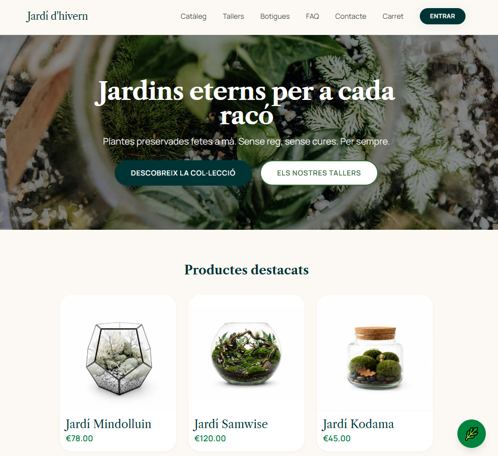
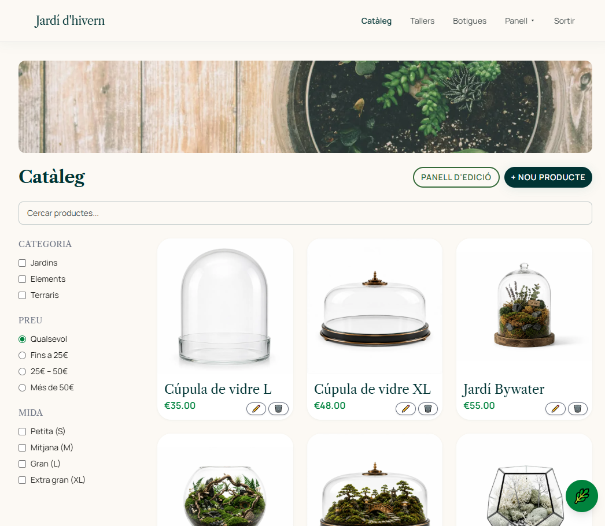
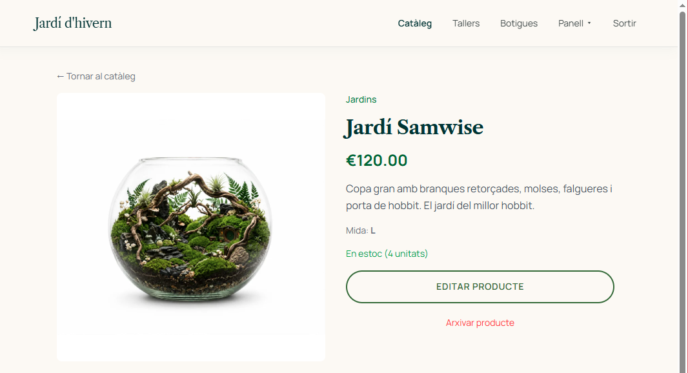
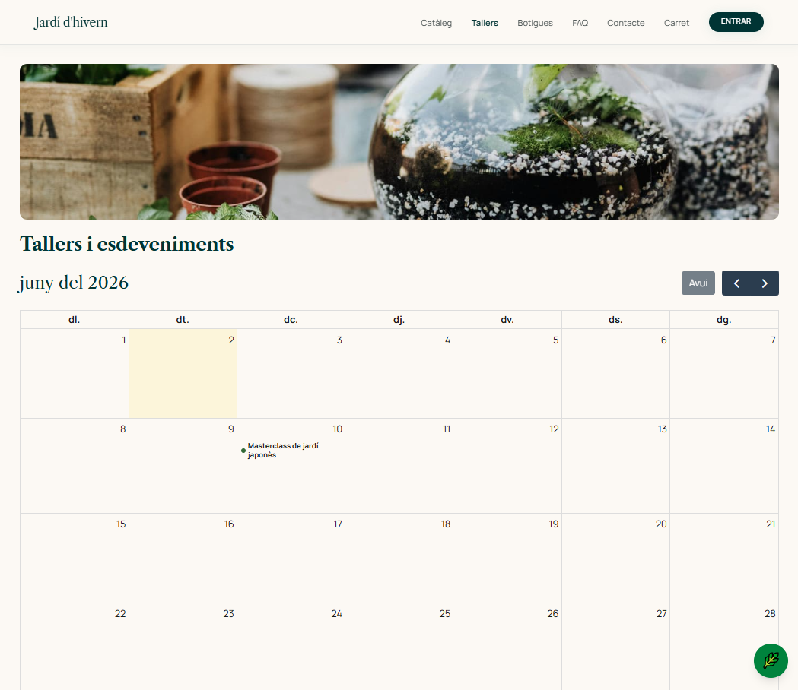
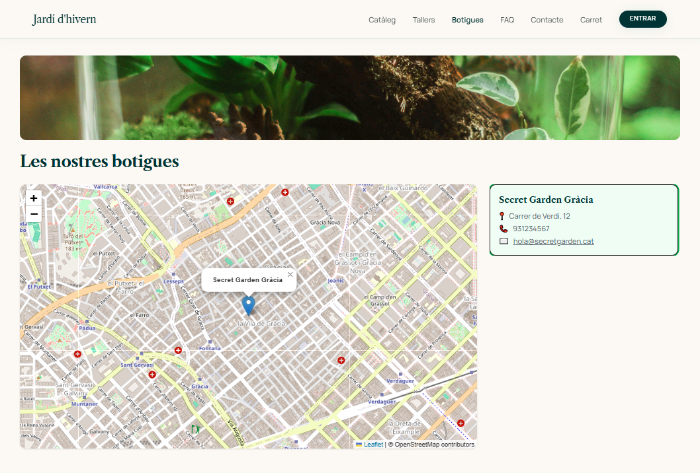
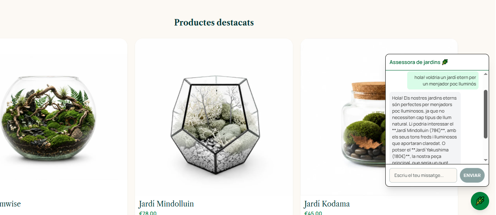
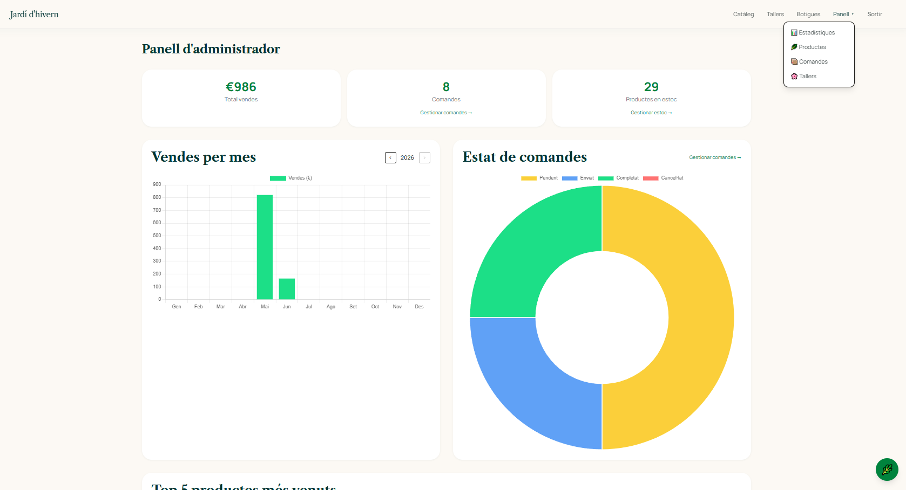

# Jardí d'hivern

> Botiga en línia de jardins eterns de plantes preservades amb tallers, mapa de botigues i assessora IA.

Projecte final de Bootcamp Frontend — Angular 22 · Supabase · Stripe · Gemini AI

**[Demo en viu](https://winter-garden.onrender.com/)**

---

## Captures de pantalla

**Home**


**Catàleg**


**Detall de producte**


**Calendari de tallers**


**Mapa de botigues**


**Chatbot IA**


**Panell d'administració**


---

## Stack tecnològic

| Capa | Tecnologia |
|------|------------|
| Framework | Angular 22 amb SSR (Node + Express) |
| Estils | Tailwind CSS v4 amb sistema de disseny propi |
| Backend | Supabase — Auth, PostgreSQL i Storage |
| Pagaments | Stripe Elements |
| IA | Google Gemini API (`gemini-2.5-flash`) en streaming |
| Mapa | Leaflet + OpenStreetMap |
| Calendari | FullCalendar |
| Imatges | Cloudinary |
| Gràfiques | Chart.js |
| Testing | Vitest |

---

## Funcionalitats

### Botiga
- Catàleg amb filtres combinats per categoria, preu màxim i mida
- Paginació de 9 productes per pàgina
- Detall de producte amb galeria d'imatges i lightbox
- Sistema de favorits per a usuaris registrats

### Carret i pagament
- Carret persistent en `localStorage` (funciona sense compte)
- Checkout amb Stripe Elements — pagament per targeta
- Redirecció automàtica a l'historial de comandes en confirmar

### Autenticació
- Registre i login per email/contrasenya
- Login amb Google OAuth
- Guards de ruta independents per a usuari i administrador

### Tallers
- Calendari interactiu amb FullCalendar (vista mensual)
- Events amb codi de color: verd (places lliures) · ambre (quasi ple, <20% restant) · vermell (complet) · gris (passat)
- Inscripció i cancel·lació de places; botó deshabilitat quan el taller és complet
- Color dels events s'actualitza en temps real en apuntar-se o cancel·lar
- Historial de tallers inscrits al compte de l'usuari

### Botigues
- Mapa interactiu amb Leaflet + OpenStreetMap
- Cards amb informació sincronitzada bidireccional amb el mapa
- Clic al marcador/card ressalta la botiga seleccionada

### Chatbot IA
- Widget flotant accessible des de qualsevol pàgina
- Respostes en streaming (`Transfer-Encoding: chunked`)
- Context enriquit amb el catàleg real de productes
- Model Gemini 2.5 Flash, respon sempre en català

### Formulari de contacte
- Pàgina `/contact` amb layout dos columnes (info de contacte + formulari)
- Camps validats: nom, email, missatge
- Confirmació visual en enviar (enviament simulat, integrable amb Resend)
- Accessible des del navbar (desktop + mòbil) i el footer

### Panell d'administració
- CRUD complet de productes amb pujada d'imatges via Cloudinary
- Soft delete de productes (arxivar/restaurar) per preservar l'historial de comandes
- Gestió de comandes amb canvi d'estat (pendent · enviat · completat)
- Creació i edició de tallers des del calendari (desktop: panell lateral · mòbil: bottom sheet)
- Comptador d'inscrits per taller, llista de participants amb email
- Dashboard amb KPIs (vendes, comandes, productes) i gràfiques Chart.js
- Filtres locals a tots els llistats: comandes per estat, productes per categoria/estoc, tallers per data
- Ordenació per columna a `/admin/products` (nom, preu, estoc)

---

## Comptes de prova

| Rol | Email | Contrasenya |
|-----|-------|-------------|
| Usuari | user1@test.com | test123 |
| Admin | admin@test.com | test123 |

### Targetes de prova Stripe

L'entorn de test de Stripe no cobra diners reals. Fes servir aquestes dades al formulari de checkout:

| Cas | Número de targeta | Caducitat | CVC |
|-----|-------------------|-----------|-----|
| Pagament correcte | `4242 4242 4242 4242` | Qualsevol data futura | Qualsevol 3 dígits |
| Targeta rebutjada | `4000 0000 0000 0002` | Qualsevol data futura | Qualsevol 3 dígits |
| Fons insuficients | `4000 0000 0000 9995` | Qualsevol data futura | Qualsevol 3 dígits |

---

## Posada en marxa

### Requisits

- Node.js >= 22.22.0 (recomanat: v24)
- npm >= 11

### Instal·lació

```bash
git clone https://github.com/isahun/winter-garden.git
cd winter-garden
npm install
```

### Variables d'entorn

Crea un fitxer `.env` a l'arrel del projecte:

```env
SUPABASE_URL=
SUPABASE_SERVICE_KEY=
STRIPE_SECRET_KEY=
GEMINI_API_KEY=
PORT=4000
```

Edita `src/environments/environment.development.ts` amb les claus públiques:

```ts
export const environment = {
  supabaseUrl: '',
  supabaseAnonKey: '',
  stripeKey: '',
  cloudinaryCloudName: '',
  cloudinaryUploadPreset: '',
};
```

### Executar en local

```bash
ng serve
```

Obre `http://localhost:4200`. El dev server inclou les API routes d'Express (`/api/chatbot`, `/api/payment-intent`), de manera que el chatbot i Stripe funcionen en local sense cap pas addicional.

Per a un build de producció:

```bash
ng build && node dist/secret-garden/server/server.mjs
```

### Tests

```bash
ng test
```

---

## Estructura del projecte

```
src/
├── app/
│   ├── core/
│   │   ├── auth/              # AuthService, authGuard, adminGuard
│   │   ├── interceptors/      # auth, error, loading
│   │   ├── models/            # Interfaces TypeScript
│   │   └── services/
│   │       ├── cart.service          # Carret — localStorage
│   │       ├── chat.service          # Streaming Gemini AI
│   │       ├── dashboard.service     # KPIs i estadístiques del panell admin
│   │       ├── favorites.service     # Favorits de l'usuari (Supabase)
│   │       ├── image.service         # Pujada d'imatges a Cloudinary
│   │       ├── payment.service       # Stripe Elements — mount i confirm
│   │       ├── product.service       # CRUD de productes (Supabase)
│   │       ├── shop-filters.service  # Filtres i paginació del catàleg
│   │       └── workshop.service      # CRUD de tallers i inscripcions (Supabase)
│   ├── features/
│   │   ├── admin/
│   │   │   ├── dashboard/     # KPIs i gràfiques Chart.js
│   │   │   ├── products/      # CRUD de productes
│   │   │   ├── orders/        # Gestió d'estat de comandes
│   │   │   └── events/        # Creació i edició de tallers
│   │   ├── account/
│   │   │   ├── account/       # Perfil d'usuari
│   │   │   ├── orders/        # Historial de comandes
│   │   │   ├── favorites/     # Productes favorits
│   │   │   └── workshops/     # Tallers inscrits
│   │   ├── shop/
│   │   │   ├── shop/          # Catàleg amb filtres i paginació
│   │   │   └── product-detail/ # Galeria, lightbox i afegir al carret
│   │   ├── checkout/          # Formulari de pagament Stripe
│   │   ├── events/            # Calendari FullCalendar (vista pública)
│   │   ├── stores/            # Mapa Leaflet + cards sincronitzades
│   │   ├── cart/              # Carret de la compra
│   │   ├── auth/
│   │   │   ├── login/
│   │   │   └── register/
│   │   ├── home/              # Landing page
│   │   └── faq/               # Preguntes freqüents
│   └── shared/
│       └── components/
│           ├── navbar/        # Glassmorphism top nav + bottom nav mòbil
│           ├── footer/
│           ├── chatbot/       # Widget flotant IA
│           └── layout/
├── environments/              # Claus públiques per entorn
└── server.ts                  # Express SSR + API routes (/api/payment-intent, /api/chatbot)
```

---

## Arquitectura

### Servidor únic (SSR + API)

Angular SSR amb Node Express com a servidor únic:
- Les rutes `/api/*` les gestiona Express directament — Stripe i Gemini mai arriben al client
- La resta de peticions les processa Angular SSR
- Supabase s'usa des del client (`anonKey` + RLS) i des del servidor (`service_role` per al chatbot)

### Capa de serveis (SRP)

Tota la comunicació amb serveis externs viu a `core/services/` — els components gestionen únicament l'estat de la UI:

| Servei | Responsabilitat |
|--------|----------------|
| `WorkshopService` | CRUD de tallers, inscripcions i cancel·lacions a Supabase |
| `ImageService` | Pujada i transformació d'imatges a Cloudinary |
| `DashboardService` | Consultes de KPIs (vendes, comandes, productes) a Supabase |
| `ProductService` | CRUD de productes a Supabase |
| `CartService` | Carret persistent a `localStorage` |
| `FavoritesService` | Favorits de l'usuari a Supabase |
| `PaymentService` | Stripe Elements — mount, confirm i recuperació del PaymentIntent |
| `ShopFiltersService` | Filtres combinats i paginació del catàleg (signals + SRP) |
| `ChatService` | Streaming Gemini AI via chunked response |

### Patrons Angular destacats

**Signals + `computed`**
Estat reactiu sense RxJS. Els filtres del catàleg, el comptador del carret i l'estat del chatbot són signals; les derivades s'expressen amb `computed()`.

**`auth.ready` Promise**
Problema de producció en SSR: al fer F5, Angular renderitza al servidor sense sessió. El guard comprova `isLoggedIn()` en mil·lisegons i retorna `false`, redirigint a `/login` tot i tenir sessió vàlida. La solució és una Promise que es resol quan Supabase confirma la sessió real:

```ts
readonly ready = new Promise<void>(resolve => (this._resolveReady = resolve));
// al inicialitzar:
supabase.auth.getSession().then(() => this._resolveReady());
// al guard:
await this.auth.ready;
return this.auth.isLoggedIn();
```

**Interceptors**
- `AuthInterceptor` — injecta el token JWT a cada petició sortint
- `ErrorInterceptor` — captura errors HTTP i redirigeix a `/login` en 401
- `LoadingInterceptor` — gestiona un indicador de càrrega global

**`afterNextRender`**
Chart.js, Leaflet i FullCalendar manipulen el DOM directament i no poden inicialitzar-se durant el render de servidor. Tots s'inicialitzen dins d'`afterNextRender()` per garantir l'execució exclusiva al client.

**Chatbot en streaming**
El servidor Express escriu la resposta de Gemini en chunks mentre es genera:

```ts
res.setHeader('Transfer-Encoding', 'chunked');
for await (const chunk of stream) {
  if (chunk.text) res.write(chunk.text);
}
res.end();
```

**Pagament Stripe (client secret pattern)**
La clau secreta mai arriba al client. El servidor crea el `PaymentIntent` i retorna només el `clientSecret`; el client l'usa per muntar Stripe Elements:

```ts
// server.ts — clau secreta, només al servidor
const intent = await stripe.paymentIntents.create({ amount, currency: 'eur' });
res.json({ clientSecret: intent.client_secret });

// payment.service.ts — clau pública al client
this.elements = stripe.elements({ clientSecret });
this.elements.create('payment').mount('#payment-element');
```

---

## Deploy a Render

1. Crea un nou **Web Service** a [render.com](https://render.com) i connecta el repositori de GitHub.
2. Configura el servei:
   - **Build command:** `ng build`
   - **Start command:** `node dist/secret-garden/server/server.mjs`
   - **Environment:** Node
3. Afegeix les variables d'entorn des del panell de Render:

| Variable | On obtenir-la |
|----------|---------------|
| `SUPABASE_URL` | Supabase → Project Settings → API |
| `SUPABASE_SERVICE_KEY` | Supabase → Project Settings → API → `service_role` |
| `STRIPE_SECRET_KEY` | Stripe Dashboard → Developers → API keys |
| `GEMINI_API_KEY` | Google AI Studio → API keys |
| `PORT` | `4000` (Render també el pot injectar automàticament) |

4. Afegeix la URL del deploy de Render a la llista de dominis autoritzats de Supabase (Authentication → URL Configuration).

---

## Llicència

Projecte educatiu — Bootcamp Frontend 2025-2026. Tots els drets reservats.
